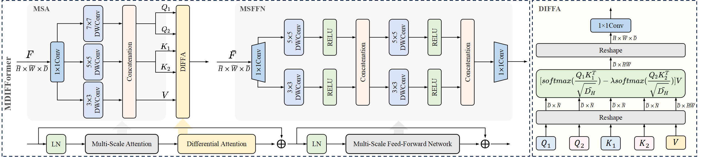
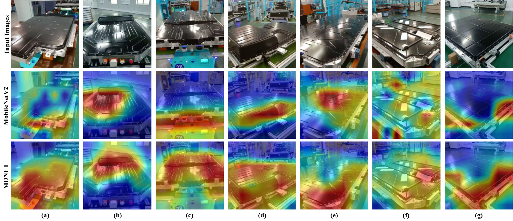

# MDNET: Multi-Scale Differential Transformer for Efficient Lightweight Image Classification

**This is an official implementation of MDNET**.

MDNET is a highly efficient and lightweight image classification network that eliminates the need for additional model compression. The core innovation of MDNET lies in the introduction of the Multi-Scale Differential Transformer (MDIFFormer), which integrates a multi-scale attention mechanism (MSA) and Multi-Scale Feed-Forward Network (MSFFN) to concurrently extract local information at multiple scales along the channel dimension. This design not only enhances the ability of the model to capture multi-scale features while maintaining extremely low computational complexity and parameters, but also helps to understand the global context more comprehensively. Furthermore, we introduce the Differential Attention Mechanism (DIFFA), inspired by the differential amplifier circuit in physics, into the domain of image processing for the first time. This mechanism emphasizes more meaningful interactions between elements in the sequence, thereby prioritizing important inputs while minimizing common-mode attention noise from irrelevant contexts. Additionally, by introducing a penalization term on the probability distribution, we further incorporate uniform noise, which strengthens the robustness of the model and reduces attention noise.


## Highlights

- **Denoising**: Inspired by differential amplifiers, we pioneer a differential attention mechanism to reduce attention noise and highlight key inputs.
- **Competitive performance**: MDNET achieves a balance between performance and parameters, consistently outperforming state-of-the-art lightweight networks without requiring additional model deep compression.
- **Enhanced Attention**：Multi-scale information improves the extraction of both local and global context.

## Environment Setup

To set up the environment you can easily run the following command:

### Create and activate environment

```
   git clone https://github.com/Gaojinghan1/MDNET.git
   cd MDNET
   conda create -n mdnet python=3.8
   conda activate mdnet
   pip install -r requirements.txt
```

## Data Preparation

Download the CIFAR and ImageNet datasets or prepare a custom dataset to the folder ./data.

## Training

Most of the training configurations can change in the "Train settings" section of setting/global_settings.py.

```
   python train.py -net mdnet -gpu
```

The training network must be specified using the -net option. Currently, the supported networks are MobileNet, MobileNetV2, and MDNET.

## Test

```
   python test.py -net mdnet -weights /PATH/TO/WEIGHT
```

## Main Results

| Method | Dataset  | Top-1 Acc.(%) | Total Params. |
| ------ | -------- | ------------- | ------------- |
| MDNET  | CIFAR100 | 73.34         | 2.38 M        |
| MDNET  | CIFAR10  | 94.82         | 2.27 M        |
| MDNET  | NEBP     | 99.52         | 2.38 M        |

## Visualization

Some visualization effects of MDNET are as follows：


## Contact

MDNET is maintained by the State Key Laboratory for Robotics and Systems, Harbin Institute of Technology. If you have any questions, please feel free to contact us via email: Jinghan Gao, Sijia Liu and Tao Xie.

## Additional Notes

We do not plan to release the new energy battery pack dataset NEBP because the dataset comes from the production line of the enterprise.
